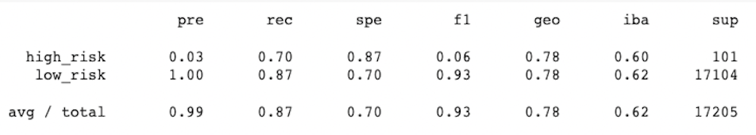

# Risky Credit Business
## Overview
Using credit card data from LendingClub, I will analyze the credit risk for different customers. Since credit risk normally involves unbalanced classes, I will evaluate models with different techniques for handling these unbalanced classes. I will oversample the data with the RandomOverSampler and SMOTE algorithms, undersample with the ClusterCentroids algorithm, combine approaches with the SMOTEENN algorithm and reduce bias with the BalancedRandomForestClassifier and EasyEnsembleClassifier machine learning models to evaluate which method is the best at predicting credit risk.

---
## Results
I began my analysis with two oversampling techniques, the RandomOverSampler and SMOTE algorithms. 

* The RandomOverSampler algorithm had the following accuracy score:

    

    In addition, the imbalanced classificaiton report was the following:

    

    This algorithm had an accuracy score of 65.47% and precision and recall scores for high-risk loans of 1% and 72%, respectively. 

* The SMOTE algorithm revealed the following metrics:

    

    

    The algorithm had a slightly higher accuracy score of 66.20% but a lower recall score of 63% for the high-risk loans, while having the same precision score as the RandomOverSampler algorithm.

* Next, I tested an undersampling technique, the ClusterCentroids algorithm:

    

    

    Undersampling the data leads to a considerably lower accuracy score of 54.42%, the same precision score for the high-risk loans and a recall score of 69% that is between the scores for the RandomOverSampler and SMOTE algorithms.

* To combine over- and undersampling techniques, I used the SMOTEENN algorithm to predict credit risk:

    

    

    A balanced accuracy score of 64.13% and a recall score of 71% for high-risk loans show that the SMOTEENN algorithm is more accurate than the ClusterCentroids algorithm but not quite as accurate as the RandomOverSampler algorithm.

* The first of the two ensemble classifiers, the BalancedRandomForestClassifier, improved on some of the accuracy metrics:

    

    

    The BalancedRandomForestClassifier demonstrated by far the highest accuracy score of 78.85% and the highest precision score for high-risk loans of 3%. Additionally, the recall score of 70% is among the highest for all the methods evaluated.

* The last machine learning model to compare is the EasyEnsembleClassifier:

    

    

    The EasyEnsembleClassifier definitely had some interesting results. While the accuracy score of 68.80% was pretty standard among all the models, the precision score of 88% for the high-risk loans was incredibly high but the recall score of 38% was very low.

---
## Summary
Comparing all the models, The BalancedRandomForestClassifier algorithm had the highest accuracy score of 78.85%, about ten percent higher than EasyEnsembleClassifier accuracy score of 68.80%, which was the second highest accuracy score. The precision score for high-risk loans with the EasyEnsembleClassifier model was by far the highest at 88%, while most of the models had precision scores around 1%. The recall scores were, for the most part, very similar and only the EasyEnsembleClassifier model had a very low score of 38%. The RandomOverSampler and SMOTEENN algorithms and the BalancedRandomForestClassifier model had the highest recall scores, coming in at 72%, 71% and 70%, respectively. To predict credit risk, it seems most important to be able to correctly determine which loans are high risk so that those loans don't unintentionally get classified as low risk and possibly lose money for the company. Therefore, the accuracy score and the recall score for the high-risk loans are the principal metrics to take into account and the BalancedRandomForestClassifier model would be the best model to use since it has the highest accuracy score by a significant margin as well as one of the top 3 recall scores. 

